# 麦克纳姆轮步兵

#### 说明
* 此代码为RM2021赛季深圳大学RobotPilots战队的麦克纳姆轮轮步兵代码

* 代码中包含了两种陀螺仪（BMI270和MPU6050）的驱动

* 代码包含三辆麦轮步兵的控制参数和逻辑，通过system.h中的Infantry宏定义控制步兵ID

* 每辆步兵包含云台、底盘、超电控制主控共计3主控，通过system.h中的Master宏定义控制主控ID**（不包括超电控制主控代码）**

* 步兵操作思维导图放在doc文件夹中

**云台代码功能：**

Master = MASTER_UP

接收遥控器控制命令，作为主机定义整车系统状态，监测整车信息标志位等等，控制云台Yaw、Pitch双轴运动，与视觉通信，控制打弹及热量限制，下发控制命令。

**底盘代码功能：**

Master = MASTER_DOWN

接收云台主控的系统状态信息，与裁判系统通信、负责UI绘制并上传裁判系统数据，并与超电控制主控通信、负责底盘功率限制和控制底盘4个驱动电机等任务。

# A

### 开发依赖工具：Keil

### 开发系统环境：windows10

### 开发硬件环境：STM32F407

# B

### 编译方式：C/C++编译

### 代码烧录：Jlink烧录

# C

### **文件目录结构、代码内容等说明：**

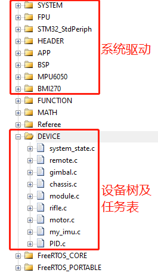

* 系统驱动部分的代码主要为基础外设驱动、stm32底层驱动程序以及外设参数初始化程序

* FUNCTION文件夹为视觉功能（自瞄、打符）的控制代码

* 设备树DEVICE文件夹中的所有代码.c文件第一个函数均为任务执行函数，motor文件中为整车电机管理程序，my_imu文件中存放对于陀螺仪数据的处理程序

* 任务调度表位于APP文件夹中的FreeRTOS_Init.c文件中

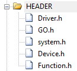

* 在“系统驱动”部分的代码中有包含了部分中间层软件库

  Driver.h中包含了简单的电机数据收发统一管理库和PID基本算法、模式辨别类

  GO.h中包含了RP机器人队伍统一的模式和整车逻辑管理类

# D

### 程序架构

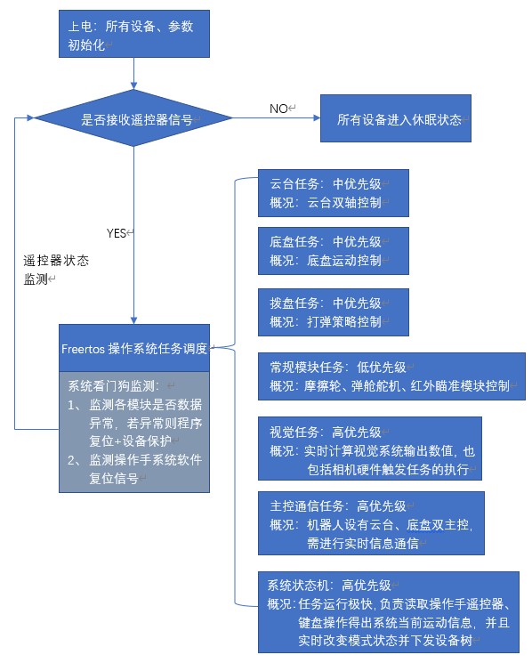

### 通信数据流线路框图

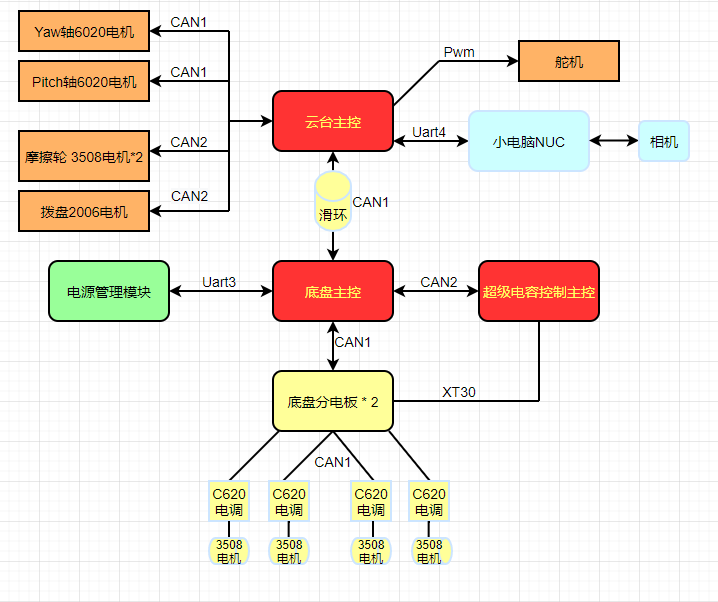

### 供电线路框图和裁判系统连接图

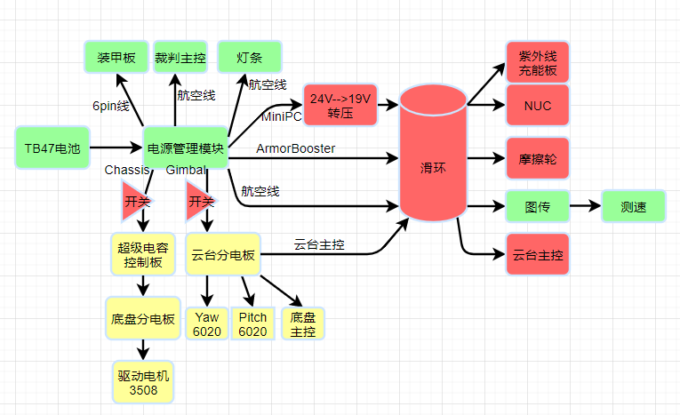

# E 重要代码原理介绍与理论支持分析

### 1、底盘闭环控制原理分析

​		由于车上搭载着底盘主控，故将滤波算法后的底盘陀螺仪yaw轴速度值作为底盘跟随运动双环控制的内环反馈，采用云台Yaw轴GM6020电机角度反馈值为双环控制外环反馈值，外环输入为Yaw轴电机角度误差。

​		陀螺仪反馈速度值经过滤波后反应会比Yaw轴电机速度反馈更快，变化实时性高，能够使底盘更实时地跟随云台运动。

​		**具体代码位于Chassis.c中文件**

### 2、系统控制命令捕捉

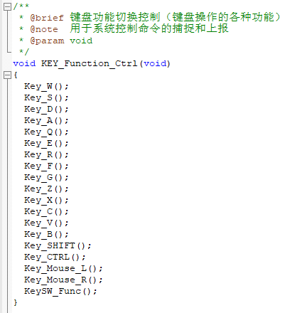

​		每个函数当中不存在轮询，执行速度较快，可以实时、同时（执行速度在1ms内）捕捉各个按键的反应值，系统采用状态检测后上报系统，再下发各个设备树任务响应状态的写法，在每个按键函数中能够清楚反映操作意图，以Z按键为例：

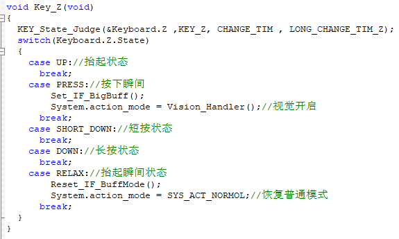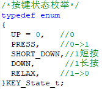

​		每个按键的5个状态在不同功能操作上发挥不同的作用，这使得后期采纳操作手反馈、商讨做出修改更加快捷、可观、有规划，并且能够保证代码整洁性和稳定性。

​		同样，对于遥控器的控制也有类似的操作，**具体程序均位于Remote.c中**。

### 3、PID算法

​		采用位置式PID算法

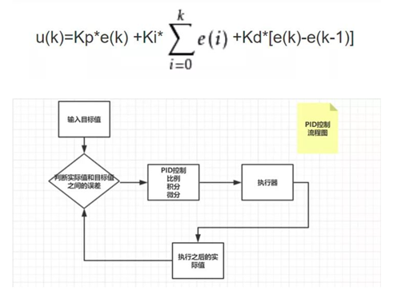

​		**对应算法代码位于PID.c文件中**

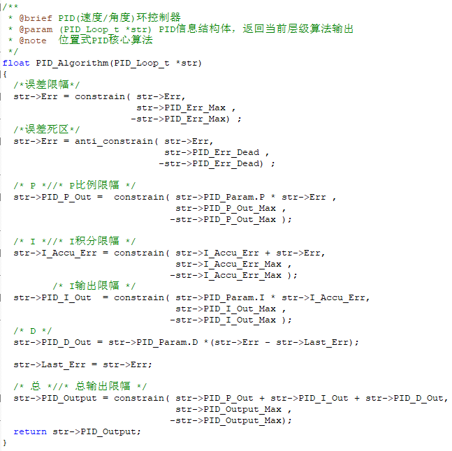

### 4、摩擦轮

​		摩擦轮采用3508电机，在射速稳定控制上，代码采用了裁判系统反馈的实时射速信息，以此作为反馈进行了一个简单的闭环控制，合理调节3508电机速度期望，并且加入温度反馈（一次训练中由于卡弹，电机加热，严重脱离正常工作温度，此时射速飙升且控制不及），测试了电机正常工作时30°~64°的射速和电机期望信息，进行了闭环+温控之后，5号步兵射速一直稳定在28.1，测试记录和比赛视频观测计算得平均偏差值最大为 ±0.36。

​		**具体程序位于Module.c文件中**。

# F 程序层级

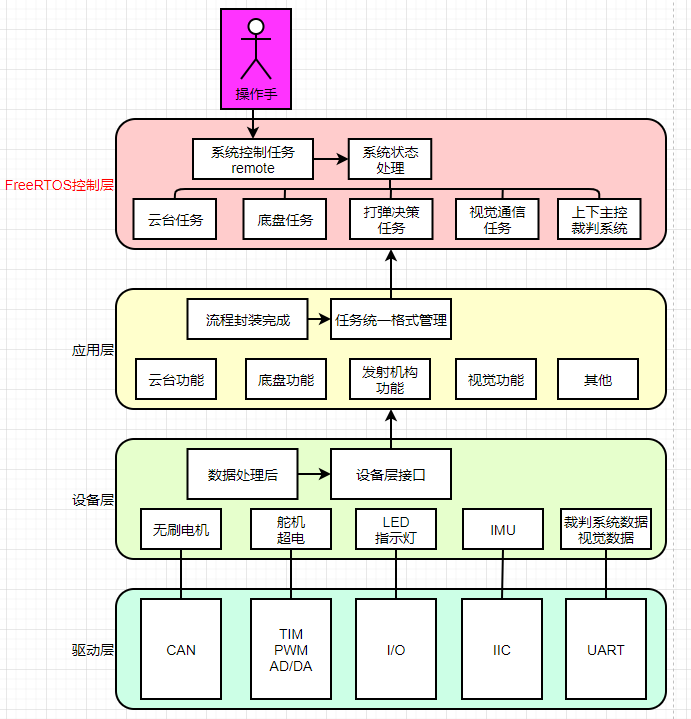

# G 未来优化方向

1、底盘加速控制上还有很大的优化空间，如功率曲线等。

2、底盘在比赛前匆忙加入旋转中心外置得陀螺模式，可对变速小陀螺进行优化。

3、CAN1作为上下主控的通信线路负担可能较大，但目前能够维持整车正常运行，是由于一开始规划不当所导致。CAN1和CAN2的任务分配上可进行优化。

小小鸣谢

在此特别感谢深圳大学RobotPilots战队给予我这么一个共同努力热情满满的大家庭，不论是哪一个组别的伙伴们一年来都辛苦了，尤其是步兵组的全体成员！同时也感谢全国所有学校共同呈现如此精彩的技术交流，祝愿所有为了梦想而努力的机甲大师们未来一帆风顺，成为自己人生中的机甲大师！

